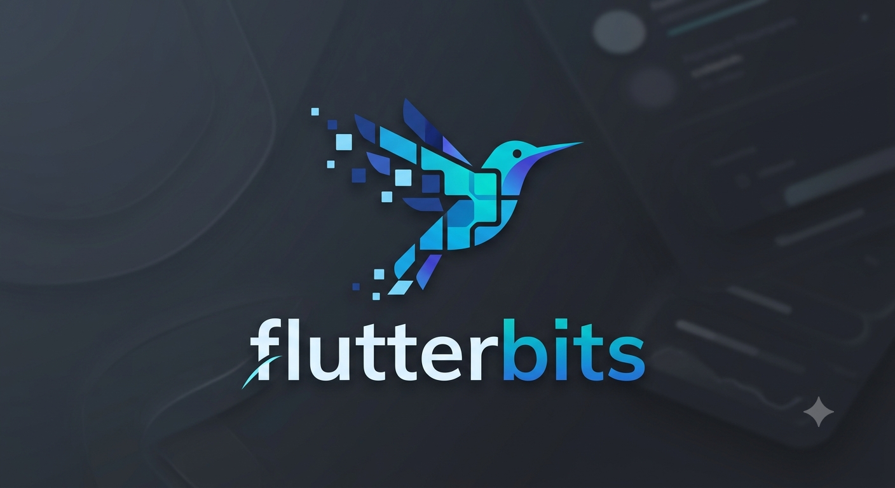

<div align="center">

# flutterbits + flutterwindcss

### Tailwind CSS's styling vocabulary and shadcn/ui's copy‑paste components — for Flutter.

[](https://github.com/SiphoChris/flutterbits/actions/workflows/ci.yaml)
[](LICENSE)
[](https://flutter.dev)
[](https://dart.dev)
[](#mental-model)
[](#project-status)
[](#contributing)

</div>

---



---

## What is this?

Two products in one monorepo, built so that **any [tweakcn](https://tweakcn.com)/shadcn theme you paste into a web generator becomes a working Flutter `theme.dart`** — theme portability no other Flutter UI library offers.

- **`flutterwindcss`** — Tailwind CSS v4's *design system and styling vocabulary* for Flutter. Design tokens (spacing, radius, semantic colors, typography, shadows) and a typed, compile‑time utility API (`.tw`) over Flutter's primitive widgets. This is the **Tailwind** layer.
- **`flutterbits`** — shadcn/ui for Flutter. **Copy‑paste** components you own, fetched via a CLI from a registry, styled entirely through `flutterwindcss` and semantic tokens. This is the **shadcn/ui** layer.

## Why it's different

| | Typical Flutter UI kit | flutterbits |
|---|---|---|
| Styling | Material widgets + `ThemeData` | Material‑free; Tailwind‑style typed utilities over the widgets layer |
| Components | Versioned dependency you can't edit | **Copy‑paste source you own**, updatable via a `diff` CLI |
| Theming | Hand‑port every color | **Paste a tweakcn/shadcn theme → get `theme.dart`** |
| Tokens | Raw colors scattered in code | **Semantic indirection** (`primary`, `muted`, `border`) — swap the theme, reskin everything |

## Mental model

Flutter has no structure/style split and no CSS cascade — the widget tree *is* the styling. flutterwindcss re‑creates Tailwind's **vocabulary and token discipline**, not a CSS engine. Theming works by **semantic indirection**, exactly like shadcn: components reference role‑named tokens (`primary`, `mutedForeground`, `border`), never raw palette swatches, so swapping the theme reskins everything.

**"Material‑free"** means no Material *components or visuals* — but the framework's generic widgets layer (`Container`, `DecoratedBox`, `FocusableActionDetector`, `WidgetState`, `Semantics`, …) is used freely. The single sanctioned Material touch in the whole repo is a `ThemeExtension` bridge so the same component works in a bare `WidgetsApp` **and** inside a `MaterialApp`.

## Project status

> **Engine complete; monorepo early.** The **`flutterwindcss` styling engine is complete through module 17** — the core (modules 0–10: tokens, theme access, the `FwStyle` resolver + `.tw` surface, layout widgets, a real CSS-grid render object, transforms, and animated theming) plus utility-coverage modules 11–17 (text completeness; filters + object-fit; transform extras + interactivity; `group-*`/`peer-*` state propagation; the ergonomics layer — gradient sugar, `ring`, named-scale sugar, `FwScroll`, dashed borders; `divide` + scroll-snap; and `bg-image` + 3D transforms + `mix-blend-mode` + `text-shadow`). Verified against the full Tailwind v4 catalog: **~96% of daily-driver Tailwind** is covered; the rest is the flutterbits component layer or genuinely impossible. The **tweakcn → `theme.dart` generator is now shipped** (in `apps/docs`); the `flutterbits` components and the registry + CLI are next. Everything ships fully implemented, tested, and reviewed — no stubs, no "TODO: productionize later."

**✅ Shipped (`flutterwindcss`):**

- **Tokens (module 1)** — the full **Tailwind v4 color palette** (22 hues × 11 shades, baked from published sRGB hex — zero runtime color math); the **full shadcn semantic vocabulary — 32 tokens** (the 19 core roles `background`/`foreground`/`primary`/`muted`/`border`/`ring`/… **plus** `chart-1…5` and the 8 `sidebar-*`), so any pasted tweakcn/shadcn theme round-trips with nothing dropped; complete **scales** (spacing 1 unit = 4px, derived + named radius, box‑shadow, typography, opacity, border‑width, z‑index, blur, breakpoints); `FwTokens.light`/`dark` (const, `lerp`‑animatable); the frozen `FwState`/`FwBreakpoint` enums; and a **CI‑authoritative golden harness**.
- **Theme access (module 2)** — `FwTheme` (InheritedWidget, pure path) + `FwThemeExtension` (Material interop) + `context.fw`, resolving in both paths with a clear error when neither is present.
- **The `FwStyle` resolver + `.tw` API (module 3)** — an accumulator with last‑wins conflict resolution that resolves lazily against interaction states and **viewport vs. container** width (kept distinct), so `hover:`/`focus:`/`pressed:`/`disabled:` variants and `sm:`/`md:`/`container*:` prefixes are first‑class. Includes the full primitive render chain and `FwStyled`, which inserts `MediaQuery`/`LayoutBuilder`/interaction wrappers only when a layer needs them — and never a spurious focus tab stop. Ships the `padding` + `bg` setters; the rest land per family below.
- **Spacing + sizing setters (module 4)** — the typed `.tw` setters for `margin` (`m/mx/my/ms/me/mt/mb`, directional per‑edge merge), fixed/min/max sizing (`w/h/minW/minH/maxW/maxH`, utility‑unit), fractional sizing (`wFraction`/`hFraction` + `align`, `wFull`/`hFull`), and aspect (`aspect`/`square`) — over module 3's existing render chain. Unit + LTR/RTL × light/dark goldens.
- **Color + border + radius setters (module 5)** — `bgGradient`; a directional, accumulating border (`FwBorderSpec`: uniform `border(w, {color})`, independent `borderWidth`/`borderColor` axes, per‑edge `borderS/E/T/B`); per‑corner directional radius (`rounded`/`roundedT/B/S/E`/`roundedNone`/`roundedFull`); and `clip`. Lands the content‑clip radius **deflation by border width** deferred from module 3, plus a clear assert for Flutter's "rounded borders must be uniform" limitation. Unit + LTR/RTL × light/dark goldens.
- **Typography setters (module 6)** — `text` (color), `textSize`, `weight` (CSS `100…900` → `FontWeight`), `leading` (line‑height ×), `tracking` (letter‑spacing), `align`, and `underline`/`lineThrough` (which combine) — over module 3's `DefaultTextStyle`/`IconTheme` merge. Unit + LTR/RTL × light/dark goldens.
- **Effects setters (module 7)** — `shadow` (theme `List<BoxShadow>`), `opacity`, `blur` (content), and `backdropBlur` — over module 3's shadow/opacity/`ImageFiltered`/`BackdropFilter` chain, with range/sign guards. Unit + light/dark goldens.
- **Layout widgets (module 8)** — the six dedicated multi‑child widgets the single‑box `.tw` chain can't express: `FwRow`/`FwColumn` (flex with typed `gap`), `FwWrap`, `FwStack`/`FwPositioned` (directional `inset` + stable `z`‑order), and `FwGrid`. All directional (RTL‑free), each chainable with `.tw` for box styling; `gap`/spacing use the framework's native `spacing`. **Responsive by breakpoint:** per‑widget `viewport`/`container` patch maps make `gap`/alignment, grid **column count** (`grid-cols-1 md:grid-cols-3`), and positioned **inset** respond to screen *or* container width — reusing the resolver's `FwBreakpoint` semantics, inserting a `MediaQuery`/`LayoutBuilder` only when needed. (The `containerSm…` `.tw` query family already shipped with the module‑3 resolver.) Unit + LTR/RTL × light/dark goldens + a narrow‑vs‑wide responsive golden.
- **Real CSS Grid (`FwGrid`)** — a custom `RenderObject` (`RenderFwGrid`), not a flex stand‑in: `fr`/`px`/`auto`/`minmax` column **and** row tracks, cell/row **spanning** and explicit placement (`FwGridItem`), sparse + `dense` **auto‑placement**, item/self **alignment**, and track **content‑distribution** (`justify`/`align‑content`: start/end/center/space‑between/around/evenly) — all directional. The only CSS‑Grid feature left out is `subgrid` (a deliberate de‑scope for negligible real‑world usage, *not* a Flutter limitation; documented on `FwGrid`).
- **Transform setters (module 9)** — `scale` (uniform), `rotate` (degrees), `translate`/`translateX`/`translateY` (utility units) — paint‑only (no reflow, matching CSS `transform`), composed T·R·S. Unit + light/dark goldens.
- **Animated theming (module 10)** — `FwAnimatedTheme`, a Material‑free `ImplicitlyAnimatedWidget` that tweens between `FwTokens` bundles via `FwTokens.lerp` over a duration/curve whenever the tokens change (colors, radii, shadows, and typography all interpolate). Drop‑in for `FwTheme`; a host's light↔dark switch crossfades every `context.fw`‑styled descendant. Unit + mid‑transition golden. **This completed the *core* `flutterwindcss` engine (modules 0–10); modules 11–14 below extend utility coverage.**
- **Text completeness (module 11)** — `font`/`fontSans`/`fontSerif`/`fontMono` (family), `maxLines`, `lineClamp` (Tailwind `line-clamp-N`), `truncate`, `overflow` (text‑ellipsis/clip/fade), and `nowrap`/`wrap` — all riding the existing `DefaultTextStyle.merge`, so they inherit into descendant text like every other typography setter. Unit + render‑chain wiring tests.
- **Filters + object‑fit (module 12)** — CSS color‑filter functions `grayscale`/`brightness`/`contrast`/`saturate`/`invert`/`sepia`/`hueRotate` that **compose** within a chain (matrices multiply, like CSS `filter: a() b()`) and resolve to one `ColorFilter.matrix`; plus `fit(BoxFit)` (Tailwind `object-*`) via `FittedBox`. Unit tests for the matrix math (luma weights, multiplicative brightness, contrast bias) + render‑chain wiring.
- **Transform extras + interactivity (module 13)** — per‑axis `scaleX`/`scaleY` (compose with uniform `scale`), `skewX`/`skewY` (degrees), `transformOrigin`; `cursor(MouseCursor)`, `pointerEventsNone`, `invisible`/`visible` (keeps layout space), `italic`/`notItalic`, and the `size` sugar. Unit + render‑chain wiring tests; a new **Interactivity** showcase section.
- **Group / peer state propagation (module 14)** — Tailwind `group-*`/`peer-*`: `FwGroup` sources its own hover/focus/pressed and broadcasts to descendants (`groupHover`/`groupFocus`/`groupPressed`/`groupDisabled`/`groupState`), and doubles as the shared scope through which an `FwPeer` reaches its **siblings** (`peerHover`/…). **Named** groups/peers (`group/sidebar`, `peer/email`) disambiguate nesting. Since Flutter has no DOM sibling selectors, the peer scope is explicit (one `FwGroup`, two channels). Unit (condition + resolver) + live widget tests (group/peer/named/injected/assert) + a light/dark golden + a **Group & peer** showcase section.
- **Ergonomics + completeness (module 15)** — the Tailwind muscle-memory layer. **Gradient direction sugar** (`bgGradientToTop/Bottom/Start/End` + the four diagonals + `bgLinear`, RTL‑aware). **`ring(width, {color, offset, offsetColor})`** — a focus ring as a zero‑blur spread shadow that composes with `shadow`. **Named‑scale sugar** for theme tokens: `shadowSm/Md/Lg/Xl/2xl/Xs/Xs2/None` and `roundedSm/Md/Lg/Xl`, resolved against the active theme at build (a single gated, opt‑in theme read in the otherwise theme‑agnostic pipeline — `resolve()` stays context‑free). **`FwScroll`** — Material‑free `overflow-auto/scroll` (`SingleChildScrollView` + `RawScrollbar`). **Dashed/dotted borders** (`borderDashed`/`borderDotted`) via a custom painter — the drop‑to‑upload staple. (`space-x/y` needs no API — `gap` is Flutter's faithful equivalent.) Unit + render + golden (`sugar_slice`) tests; a new **Utilities** showcase section.

- **Final Tailwind completeness (modules 16–17)** — `divide` (border between flex children, `FwRow`/`FwColumn`) and **scroll-snap** (`FwScroll.snapExtent`/`snapAlign`) in module 16; **`bgImage`** (background-image), **3D transforms** (`rotateX`/`rotateY` + `perspective`), **`blendMode`** (`mix-blend-*`, via the `FwBlendMode` render object), and **`textShadow`** (v4) in module 17. Cross-checked against the complete Tailwind v4 utility catalog. Unit + render + visually-validated; example demos for `bgImage` (a bundled-asset background image), `divide`, scroll-snap, 3D transforms, `mix-blend` (the canonical CMY-multiply circles), and `text-shadow`.

**✅ Shipped (theme generator — `apps/docs`):**

- **tweakcn → `theme.dart` generator** — paste any tweakcn/shadcn theme (Tailwind v4, any of `oklch`/`hsl`/`rgb`/hex), get a working Flutter `theme.dart` + `theme.json`. A pure-TS `parse → color → emit` pipeline: a hand-rolled, vector-tested OKLCH→sRGB core (faithful-clip default + opt-in perceptual gamut-map), a tolerant `:root`/`.dark` parser (rejects Tailwind v3), and an emitter for all 32 colors + additive radius + 7 shadow slots + fonts + tracking — **nothing dropped, everything reported**. End-to-end golden-verified against the engine's reference theme across all four input formats. Ships with a live web UI ([`/theme-generator`](apps/docs/src/app/(home)/theme-generator)) — paste → preview (swatches/radius/shadows, light+dark) → download — and a [docs page](apps/docs/content/docs/theme-generator.mdx).

**🚧 Next on the roadmap:**

1. **`flutterbits` components** and the **registry + CLI** (`flutterbits add` / `diff`). *(The engine is ready — ~96% of daily-driver Tailwind is covered and a full-catalog audit found no engine blocker.)*
2. **Remaining engine long-tail (by demand only)** — niche/feasible items (`inset-shadow`, `mask-*`, backdrop color filters, `columns`, negative margins, `scroll-margin/padding`, decoration styling) built when a real component needs one; the rest is the [coverage & roadmap](docs/superpowers/specs/2026-06-07-flutterwindcss-coverage-and-roadmap.md)'s delegated (animation → [`flutter_animate`](https://pub.dev/packages/flutter_animate); forms/prose/tables/SVG → flutterbits) / impossible sets.

See [`docs/superpowers/specs`](docs/superpowers/specs) for the full engine design and [`docs/superpowers/plans`](docs/superpowers/plans) for the implementation plans.

## Repository layout

```
packages/
  flutterwindcss/        # pub package: tokens, FwTheme, FwStyle accumulator, .tw utilities
apps/
  example/               # flutterwindcss engine showcase (pure path, runnable); component golden target (planned)
  docs/                  # Fumadocs site + the tweakcn→theme.dart generator (shipped: parse→color→emit pipeline, web UI at /theme-generator, docs)
registry/                # (planned) source-of-truth copy-paste components
tooling/                 # registry builder + the Tailwind palette baker
docs/superpowers/        # design specs and implementation plans
```

Dependency resolution uses **pub workspaces** (`resolution: workspace`).

## Getting started (development)

> Requires **Flutter ≥ 3.29 / Dart ≥ 3.7** (the wide‑gamut `Color` API and `Flex` spacing land in 3.27; we floor at 3.7 for the modern `dart format` style). CI verifies this floor on a pinned 3.29 job, and pins 3.41.9 for deterministic goldens.

```bash
# From the repo root
flutter pub get                                   # resolves the workspace

cd packages/flutterwindcss
flutter test                                      # run the unit + golden suite
flutter analyze --fatal-infos --fatal-warnings    # zero-warning bar
dart format --line-length 100 .                   # 100-col formatting

# Regenerate the baked Tailwind palette (from repo root)
dart run tooling/bake_palette.dart
```

A peek at the eventual authoring experience:

```dart
// Components read tokens only via context.fw, and style through .tw:
Text('Click me')
  .tw
  .px(4).py(2)                      // padding in utility units (4px each)
  .bg(context.fw.colors.primary)    // semantic token — themes for free
  .rounded(context.fw.radii.md)
  .hover((s) => s.bg(context.fw.colors.accent));
```

## Design principles (non‑negotiable)

- **Semantic tokens only** in components — never hardcoded colors or raw palette swatches.
- **Directional by default** (`EdgeInsetsDirectional`, `BorderRadiusDirectional`) — RTL is free.
- **Provider‑agnostic** token access via `context.fw` — never `Theme.of(context)` directly.
- **No runtime string parsing** — utilities are typed method calls resolved at compile time.
- **Accessibility is required**, not optional — roles, focus rings, and keyboard activation ship with every component.

The complete operating manual lives in [`AGENTS.md`](AGENTS.md).

## Contributing

This is an early‑stage solo project rolling out wave‑by‑wave behind a strict golden‑test safety net. Issues and PRs are welcome — please read [`AGENTS.md`](AGENTS.md) first; it encodes the architecture decisions that keep theme portability and Material‑freedom intact.

## Acknowledgements

Inspired by [Tailwind CSS](https://tailwindcss.com), [shadcn/ui](https://ui.shadcn.com), and [tweakcn](https://tweakcn.com). Built on [Flutter](https://flutter.dev).

## License

[MIT](LICENSE) © 2026 Sipho Nkebe
